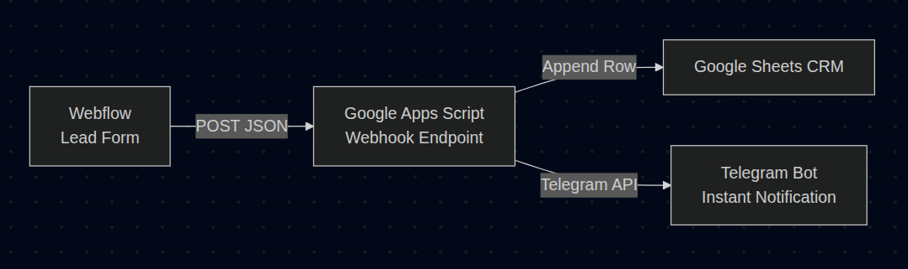
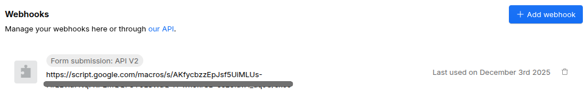
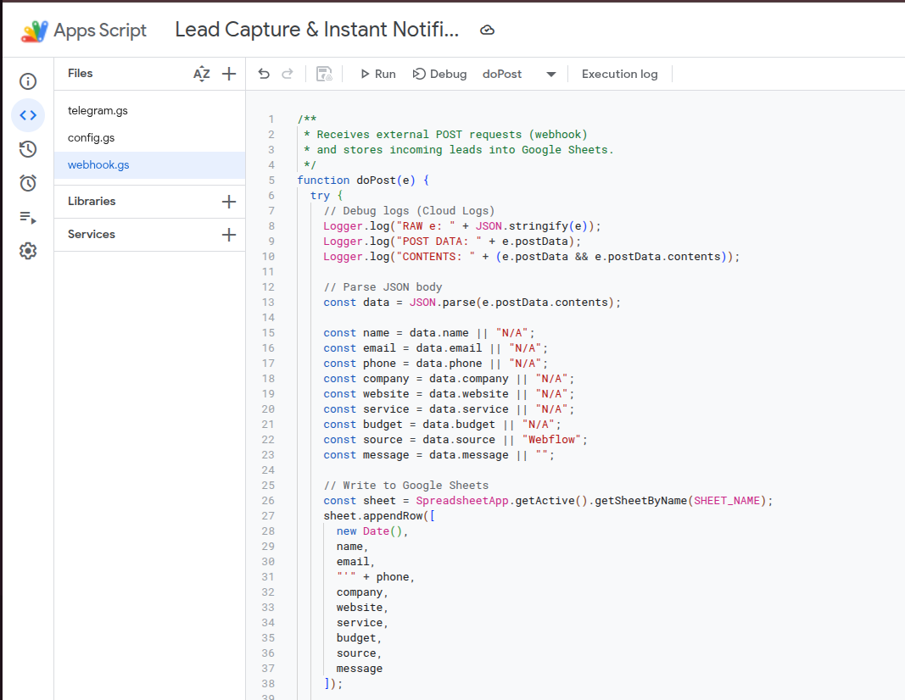
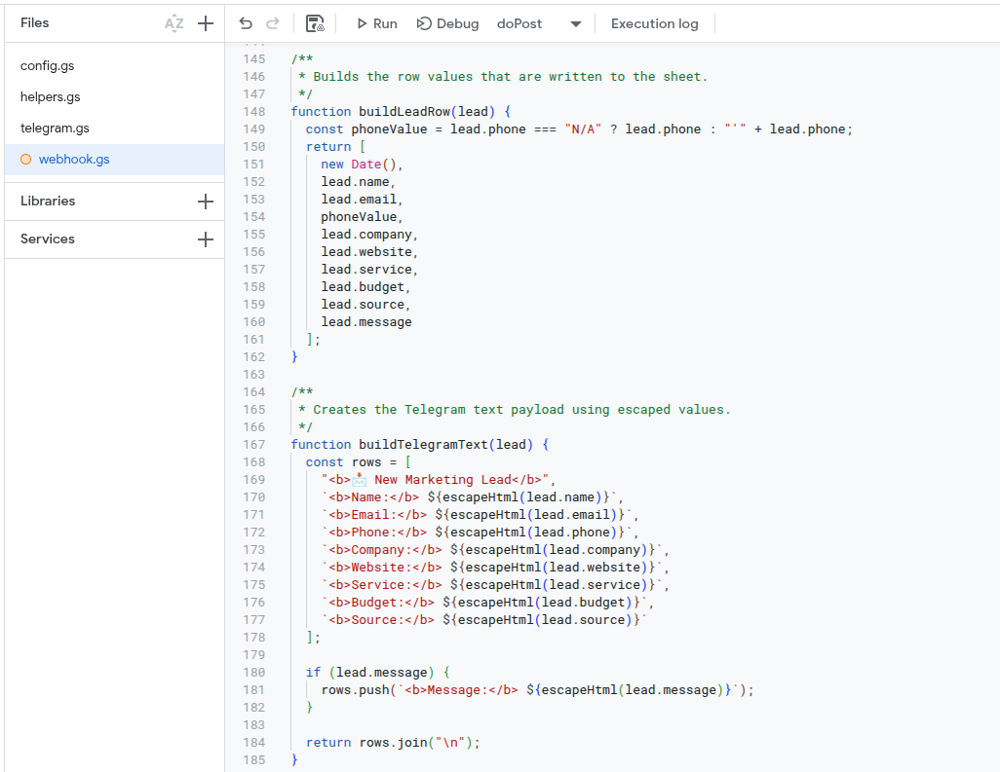
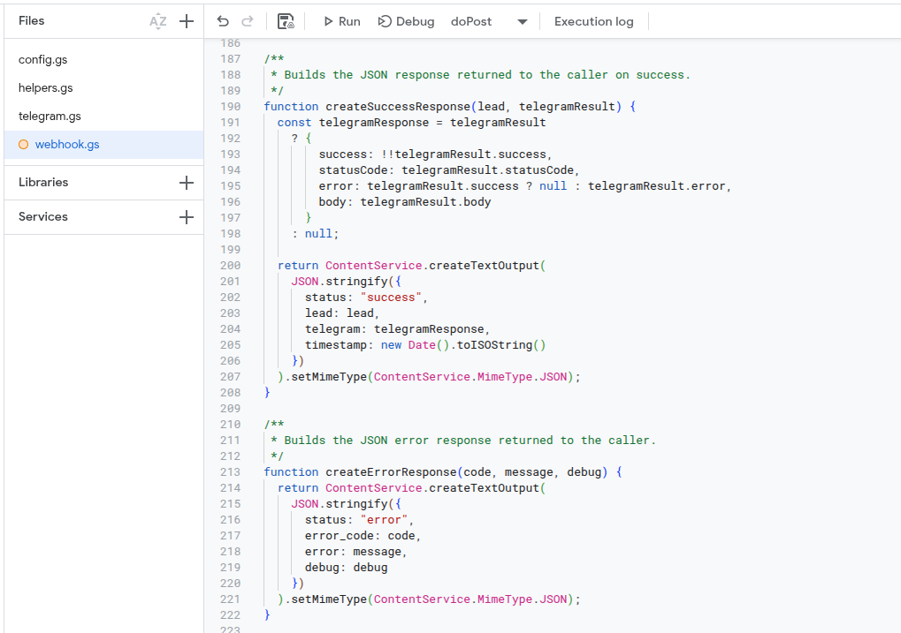
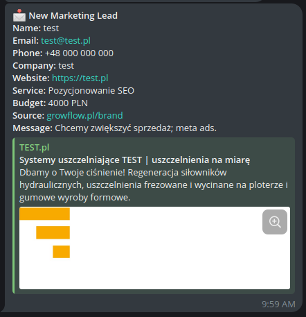
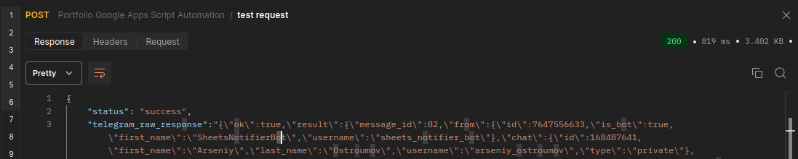

# Lead capture webhook → Telegram alert

Automates marketing lead intake from any web form into a Google Sheet and instantly delivers a formatted Telegram alert so you can respond without opening spreadsheets. Built as a Google Apps Script project, it keeps the workflow light for a solo operator or a small growth team.

## Highlights
- Parses key lead fields from JSON POST payloads and appends them to a sheet named `Leads`.
- Sends an HTML-formatted Telegram message with all lead context, including company, service, budget, source, and optional message.
- Logs every webhook call, handles malformed payloads gracefully, and returns structured success/error JSON so clients can act on failures.
- Ships helper utilities for safe JSON parsing, HTML escaping, and normalized string fallbacks to keep downstream integrations predictable.
- Includes detailed logging/Dashboard screenshots so you can demonstrate deployment and monitoring in your portfolio.

## 🛠 Tech Stack
- Google Apps Script
- Webflow Webhooks
- Telegram Bot API
- Google Sheets
- Postman (testing)

## Story
This automation was built for a digital marketing agency in Poland to eliminate manual lead handling and accelerate response time from minutes to seconds.

## Getting started
1. **Create credentials**
   - Spin up a Telegram bot via `@BotFather` and note the bot token.
   - Grab the target chat ID (group or individual) where you want alerts to land.
2. **Prepare the sheet**
   - Create a Google Sheet titled `Leads` (or update `src/config.gs` to match another tab) and add a header row tracking timestamp, contact info, service, budget, source, and message.
3. **Install the script**
   - Open Google Apps Script, create a new project, and replace the default files with the contents of `src/config.gs`, `src/webhook.gs`, and `src/telegram.gs`.
   - In `config.gs`, replace `YOURS_TELEGRAM_TOKEN` and `YOURS_TELEGRAM_CHAT_ID` with the values you collected.
4. **Deploy a webhook**
  - Deploy `doPost` as a web app (with access set to “Anyone, even anonymous”) and copy the generated URL.
  - Point the webhook at the client-facing Webflow site so every published form sends JSON lead data (fields like `name`, `email`, `phone`, `service`, `budget`, `company`, `website`, `message`) into this automation layer.
5. **Link Telegram**
  - The script already builds a Telegram payload; no extra setup is required beyond valid tokens and chat ID.

## Local deployment (clasp)

To keep the Apps Script project in sync without using the online editor, this repo includes `clasp` configuration and helpers.

1. Install the tooling: `npm install`.
2. Update `.clasp.json` so `scriptId` matches the target Apps Script project.
3. Authenticate with Google: `npx clasp login`.
   - Make sure the Apps Script API is enabled for the account at `https://script.google.com/home/usersettings`. Clasp push will fail with `User has not enabled the Apps Script API` until the toggle is turned on and the change propagates.
4. Publish a new version via `npm run deploy`, which runs `clasp push`, creates a timestamped version, and updates the web app deployment. If you only need to sync the files, run `npm run push` instead.

   The `deploy` script is powered by `scripts/deploy.js`, so every run pushes, versions, and redeploys automatically.

The manifest and `.gs` files live inside `src/`, so the local tree mirrors the Apps Script project exactly.

## Workflow
Leads hit the webhook, the script logs everything, validates and normalizes the payload, appends a row in Google Sheets, and posts a Telegram notification with a bolded headline plus field labels so the message is human-friendly. Any missing fields fall back to `N/A`, errors return structured JSON, and the raw Telegram response stays available for debugging.

## Error handling & debugging
- `src/helpers.gs` centralizes safe JSON parsing, HTML escaping, and string normalization so every module handles missing or malformed data the same way.
- `src/webhook.gs` builds a debug context for every request, gracefully reports missing postData or sheet issues, and always replies with a clear success/error object plus the latest debug payload.
- `src/telegram.gs` verifies token/chat configuration, inspects Telegram HTTP responses, decodes the body, and surfaces both success and failure outcomes to the webhook caller for visibility.

## How It Works
1. A user submits a form on Webflow.
2. Webflow triggers a webhook and sends JSON to Google Apps Script.
3. The Apps Script parses, validates and stores data in Google Sheets.
4. The script generates a formatted HTML message.
5. Telegram bot sends instant notification to the marketing team.

## Screenshots
- Architecture overview: 
- Webhook deployment preview: 
- Source code context (part 1): 
- Source code context (part 2): 
- Source code context (part 3): 
- Google Sheet CRM view: 
- Telegram message example: 
- Telegram API response log: 

## 🛡️ Privacy Notice
This project uses synthetic lead data generated for testing.
No real customer data is exposed in screenshots or examples.

## 📘 License
MIT License. Free for use in portfolio and personal projects.

## 🎯 Summary
This automation helps agencies:

- Speed up lead processing
- Eliminate manual data entry
- Centralize submissions in a CRM
- Respond instantly via Telegram
- Avoid losing inbound leads

## 👨‍💻 Author
Arseniy Ostroumov  
Automation Engineer • Google Apps Script • Integrations • Webhooks • Telegram Bots
